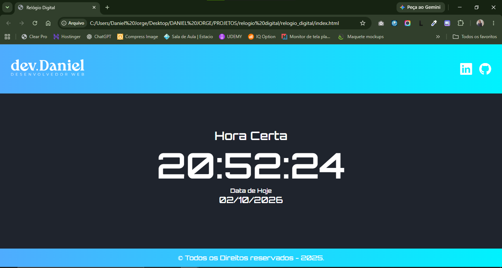

# 🕒 Relógio Digital

Aplicação web de um relógio digital em tempo real com exibição da data atualizada, desenvolvida em HTML5, CSS3 e JavaScript.

---

## 📸 Demonstração



---

## 🚀 Tecnologias Utilizadas

O projeto foi construído utilizando as seguintes tecnologias:

- **HTML5:** Estruturação semântica da página.
- **CSS3:** Estilização moderna, esquema de cores em gradiente, flexbox e tipografia digital com a fonte [Orbitron](https://fonts.google.com/specimen/Orbitron) do Google Fonts.
- **JavaScript (ES6):** Manipulação da DOM e atualização dinâmica da hora e data em tempo real com `Date()` e `setInterval()`.
- **Bootstrap Icons:** Ícones para links de redes profissionais.

---

## ⚙️ Funcionalidades

- [x] Exibição das horas, minutos e segundos sincronizados com o sistema local.
- [x] Exibição da data no formato padrão local (`DD/MM/AAAA`).
- [x] Atualização contínua a cada segundo sem necessidade de recarregar a página.
- [x] Layout responsivo adaptado para dispositivos móveis e desktop.
- [x] Barra de navegação com logotipo e atalhos diretos para redes profissionais.

---

## 📁 Estrutura do Projeto

```text
relogio_digital/
├── asset/
│   ├── css/
│   │   └── style.css
│   ├── img/
│   │   ├── logo.png
│   │   └── preview.png
│   └── javascript/
│       └── script.js
├── index.html
├── LICENSE
└── README.md